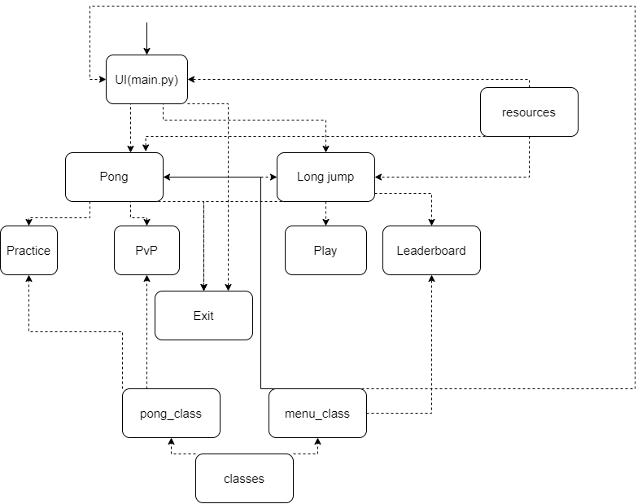

# Arkkitehtuurikuvaus

## Rakenne

Ohjelman rakenne noudattelee monitasoista kerrosarkkitehtuuria, ja koodin pakkausrakenne on seuraava:

Pelin rakenne koostuu erilaisista valikoista ja tiloista, joita ohjaa ja hallinnoi luokka nimeltä `menu_class`. Tässä on yhteenveto rakenteesta:

1. Päävalikko[main.py](https://github.com/KirinPoersti/ot-harjoitustyo/blob/main/Sports-Rally/src/main.py) : Tämä on pelin aloituspiste. Sen avulla pelaajat voivat valita kahden pelivaihtoehdon välillä: Long Jump ja Pong. 

2. Pituushyppy-valikko[longjump_main.py](https://github.com/KirinPoersti/ot-harjoitustyo/blob/main/Sports-Rally/src/longjump/longjump_main.py): Kun pelaaja valitsee päävalikosta Long Jump, hän pääsee Long Jump -valikkoon. Täällä he voivat joko aloittaa Long Jump -pelin pelaamisen tai tarkastella tulostaulukkoa. Tulostaulu on käyttöliittymä, joka käyttää `menu_class`-luokkaa näyttämään pelaajien sijoitukset tai pisteet.

3. Pong-valikko[pong_main.py](https://github.com/KirinPoersti/ot-harjoitustyo/blob/main/Sports-Rally/src/pong/pong_main.py): Jos pelaaja valitsee päävalikosta Pongin, hän pääsee Pong-valikkoon. Täällä hänellä on kaksi vaihtoehtoa: Harjoitustila, jossa hän voi pelata yksin, ja PvP-tila, jossa hän voi pelata toista pelaajaa vastaan.

4. Poistu [Exit]: Kaikissa kolmessa valikossa (päävalikko, pituushyppyvalikko ja Pong-valikko) on poistumisvaihtoehto, jonka avulla pelaajat voivat lopettaa pelin tai palata korkeamman tason valikkoon.

5. Resurssit: Kaikki pelin resurssit (äänitehosteet, taustamusiikki, taustakuvat ja leaderboardin CSV-tiedosto) tallennetaan ja haetaan kansiosta nimeltä `resources`
